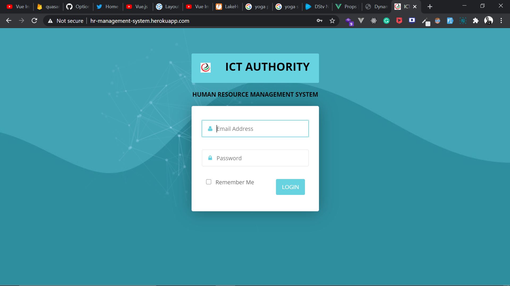

# Laravel 6 Human-Resource-Management-System for companies

 composer install

 php artisan key:generate

 php artisan migrate
 
 php artisan migrate:fresh --seed
 
 php artisan serve

<!--- or this way to add images --->

<!---  
